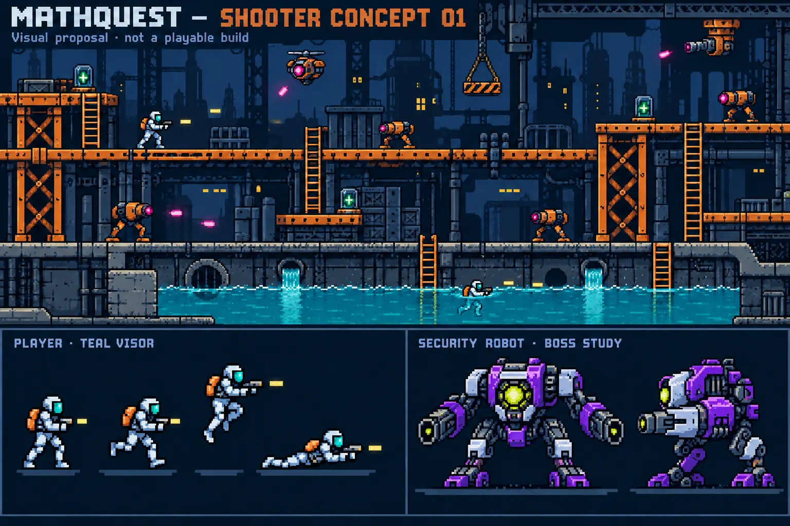

# MathQuest — Side-scrolling Shooter

**Design and technical specification v0.1 · 30 September 2026 (Asia/Shanghai)**  
**A WILLIAM MCADA PRODUCT**  
**Working identifier:** `industrial-shooter`; no narrative title selected.  
**Stage:** DESIGN → CHANGE SPEC. No game implementation, runtime verification, release or deployment is represented by this document.  
**Scope:** One complete, polished individual-player level for later MathQuest cartridge integration. This is not the aerial shooter or the multiplayer brawler being discussed separately.

## 1. Source, authority and decision status

Canonical repository: `williammcada/Math-Quest---Vault-7-`. Current `main` was checked on 30 September 2026 and is `7ac12fb98f7ccda591be4ee0bd6baa2f0ee81c28`, the merged v0.9.4 candidate. Canonical frontend: `public/`; session service: `src/`. Root-level historical copies are not the implementation target. No current live frontend/Worker version was established in this design session.

Handbook revision: `00cbde605ab08203b6b5fd2374d225155608fc29`. Consulted `AI-START-HERE.md`, `UNIVERSAL-RULES.md`, `CONDITIONAL-STANDARDS.md` S-02/S-03/S-04 and `RELEASE-CHECKLIST.md`. Relevant U-01–U-08 are already selected locally by the project brief; their shared scope remains seeded. U-09 is approved and applies to saved progress and practice records. Conditional modules and checklist retain their draft/proposed status; no handbook amendment or global ratification is made.

Project sources consulted: README; `docs/PROJECT-BRIEF.md`; applicable mobile, preparation, cross-cartridge and timing sections of `docs/change-specs/v0.9.2.md`; applicable lifecycle and preservation sections of `v0.9.4.md`; historical `docs/RUNTIME_CONTRACT_v0.6.md`; `public/games/registry.js`; `public/engine/{game-host,controls,game-audio}.js`; `public/games/nightfall/adapter.js`; `src/engine/equipment.js`; `src/cartridges/registry.js`; and `src/cartridges/nightfall/rescue-server.js`.

The owner approved the core decisions in §2 and the revised visual reference. Newly authored level placement, numerical tuning, detailed input precedence and boss scheduling below are **proposed specification details for review**, not claims of previously approved values. These details must be settled before implementation. Agility is explicitly experimental. No broad new-engine rewrite is authorized by this document.

## 2. Accepted design contract

| ID | Accepted requirement |
| --- | --- |
| SH-01 | One substantial Contra-inspired side-scrolling run-and-gun level; approximately 2–3 minutes for a successful traversal, with engagement comparable to Nightfall City Run. |
| SH-02 | Moderately challenging; three health by default, one health damage per ordinary hit, brief damage protection, no compulsory unavoidable damage. |
| SH-03 | Three lives total: initial attempt plus two respawns. Midpoint and boss-entry checkpoints. Restore full health and retained upgrades on respawn; reset the applicable checkpoint section and boss when appropriate. |
| SH-04 | One authoritative shared five-minute action window. Individual pause, delayed Start, retry, backgrounding and disconnect do not extend it. Teacher whole-session pause does. At expiry unresolved records close and the group progresses. |
| SH-05 | Continuous shooting, infinite ammunition, eight-direction movement/aim pad, Jump control; no dash. |
| SH-06 | Run, jump, crouch, prone, drop through platforms, climb, and surface-swim all appear in the first level. No diving, underwater movement or oxygen mechanic. Fire while swimming. |
| SH-07 | Upper platform route, central combat route and lower surface-water route, with route changes and convergence at checkpoints. All required routes and the boss remain completable without upgrades. |
| SH-08 | Basic straight-firing gun; spread blaster replaces it for the entire run. Piercing beam removed. No midlevel weapon replacement. |
| SH-09 | Three distinct preparation upgrades: spread blaster, four-health capacity, experimental agility (+10% movement and double jump). More than one upgrade requires additional mathematics, following Nightfall. No upgrade stacking duplicates. |
| SH-10 | Fixed optional health caches reward observation and navigation. Restore one health, capped at capacity. Agility helps access, but cannot be required for completing the level. |
| SH-11 | Six ordinary robot types: patrol, ceiling turret, flying drone, heavy, lobber, surface skimmer. Large robot boss with clearly signaled patterns. No human opponents. |
| SH-12 | Armored space-suit player with teal visor; retro pixel art; dark steel factory, orange structures, cyan water; boss violet/silver/lime palette. |
| SH-13 | Energetic electronic/chiptune level music, separate boss music, distinct effects and visible mute. Visual warnings accompany audio warnings. |
| SH-14 | Landscape iPad and iPhone Safari touch; desktop keyboard; readable portrait setup/help and safe rotate prompt. Hosted standalone practice from the first playable candidate. |
| SH-15 | Narrative is deferred. Gameplay and academic evidence remain separate. The underlying session platform, existing cartridges and deployment infrastructure are preserved. |

“Enemies that cannot be dodged” means some opponents must be defeated to progress, not that their attacks must hit the player. “Only dodged by changing routing” means a safe bypass requires another lane. Both are compatible with readable counterplay and the three-hit baseline.

## 3. One-level blueprint — proposed

### 3.1 Route structure and pacing

Propose a horizontal world 6,400 logical pixels wide and 640 high, using 16-pixel tiles and a 640 × 360 gameplay view. These dimensions are draft engineering values, not a visual approval of every tile. Upper lanes generally occupy y=96–224, middle lanes y=288–368, and water surfaces y=464–512; coordinates use a top-left origin. Local rises and connecting shafts create route transitions. The camera follows horizontal progress and eases vertically when the player changes lanes; it never squeezes the entire map into one screen.

The approved image is a visual study, not a collision map. Before implementation, turn this blueprint into an authored tile/collision map with exact spawn and warning-zone coordinates and validate all jumps against baseline physics.

| Sector | World x | Target time | Encounter and route purpose |
| --- | --- | --- | --- |
| A — Loading apron | 0–800 | 15–20 s | Safe starting space, first patrol, low burst to duck, ladder, small optional upper ledge, first obvious route choice. Introduce threats one at a time. |
| B — Coolant works | 800–2,200 | 25–35 s | Three traversable lanes: gantry gaps above; patrol and turret pressure in the middle; surface swimming below. A visible health alcove rewards a short prone passage. Two route-crossing opportunities. |
| C — Transfer lock | 2,200–2,700 | 10–15 s | Routes reconverge. One heavy guard must be defeated in a cover-equipped arena. Its destruction opens the midpoint checkpoint. No other mandatory trash-enemy clear. |
| D — Foundry crossing | 2,700–4,200 | 30–40 s | Second branch: crane drops above, timed presses in the middle, skimmer and electrical pulses on water. Route crossings let the player escape sustained pressure. |
| E — Security approach | 4,200–5,400 | 20–25 s | Alternating platform heights and a dangerous central heavy corridor. Upper or lower bypass avoids that heavy pair; fighting them is a valid direct route. All routes join a safe boss-entry checkpoint. |
| F — Security chamber | 5,400–6,400 | 30–45 s | Single clear boss arena, no random adds. Boss defeat completes the action run. No extra escape stage. |

Total proposed successful-run range: 130–180 seconds including boss and brief checkpoint feedback. Side exploration and deaths may extend the run within the five-minute shared window. These are pacing targets to measure, not predictions already verified.

Each branch has a complete baseline route. Upper-to-middle drops and ladders connect lanes; water has clearly readable banks and ladders. Provide connectors around x=1,200/1,800 and x=3,100/3,800, with final bypass convergence before x=5,400. Exact positions require map review. No mandatory double-jump gaps. Normal required gaps should be at most 96 pixels under the provisional physics, with generous landing areas. Optional climbs may be shorter with agility but remain reachable by an alternate normal route.

Prone ducts have adequate entry/exit standing space and no attacks that force damage while trapped. Thin pass-through platforms and solid floors use distinct visual edge treatments. Water is traversable terrain, not a falling-death trap. Camera framing previews the landing surface before commitment.

### 3.2 Authored enemy inventory

Proposed fixed starting population: **24 ordinary robots plus one boss**. Alternate-route enemies are not all mandatory kills. Enemies activate in a bounded region around the camera; they do not attack from unseen offscreen positions or respawn merely because the camera scrolls.

| Sector | Authored IDs |
| --- | --- |
| A | P01, P02, T01, D01 |
| B | P03, T02, D02, S01, L01 |
| C | H01 — required midpoint guard |
| D | P04, P05, P06, T03, T04, D03, L02, S02 |
| E | P07, P08, T05, D04, H02, H03 |
| F | BOSS01 |

Totals: 8 patrols, 5 turrets, 4 drones, 3 heavies, 2 lobbers, 2 skimmers. A route-specific layout review must prevent attacks across solid floors, through cover, or into the player before a hazard is revealed.

### 3.3 Hazards and health caches

| Hazard | Proposed placement and counterplay |
| --- | --- |
| Falling scrap/crane load | Two fixed sites in D, one in E. Visible overhead load, flashing support and floor shadow for at least 0.9 s before release. Step aside or use another lane. Debris clears; it never permanently blocks a route. |
| Mechanical press | One central crossing in D. Visible raised/charging/descending states, at least 0.9 s warning, a safe waiting pocket and a complete alternate route. |
| Electrical water pulse | Two short water sections, B and D. Warning beacons and a pulsing surface pattern for at least 1.0 s; visible safe bank before the section. No silent map-wide water damage. |
| Platform fall | Recover onto a lower playable route when possible. If out of bounds, lose one health and return to the last safe nearby foothold with protection. No instant death. |

Start with slow periodic schedules, not random unavoidable triggers. Warning time is simulation time and freezes with safe local simulation pause; the shared classroom deadline does not. No two hazards may cover every escape destination simultaneously. A health pickup must never require unavoidable damage greater than its benefit.

Propose four fixed +1 repair caches: A upper optional ledge, B prone side duct, D short water-bank detour, E upper optional ledge. Use IDs R01–R04. At full health, leave the pickup in place. Collection is immediate on overlap, shows readable feedback, and is recorded once per attempt. No random health drops and no extra-life pickups in this candidate. Optional healing does not raise health capacity or award preparation slots.

## 4. Controls and physics — proposed exact contract

### 4.1 Touch and keyboard

Use one fixed eight-sector pad with a center dead zone. One thumb slides between sectors without lifting. Diagonals are full selectable sectors; no need to press two separate buttons. This requires a shooter-specific input implementation because the current shared button binder associates one pointer with one button until release.

| Action/state | Proposed behavior |
| --- | --- |
| Left/right | Run at normal speed and face that direction. No separate Run button. |
| Up-left/up-right | Run and aim 45° upward. Up alone aims straight up while stationary, except on an engaged ladder. |
| Down-left/down-right | Run and aim 45° downward while standing. They do not count as a prone gesture. |
| Down while grounded | Crouch and shoot horizontally in last facing direction. |
| Two Down taps within 300 ms | Enter prone only on ordinary ground, outside ladder/water interaction. Each tap requires release/dead-zone return. Left/right without Down exits prone into running; Up stands if headroom permits. Proposed short prone passages use slow crawling at 45 px/s when holding Down plus left/right after entering prone. This contextual distinction must be explicitly demonstrated in control review; crawling itself awaits approval. |
| Jump | Ground jump; variable height from button release. No automatic repeat while held. From prone, stand/jump only with clearance. |
| Down + Jump on thin platform | Drop through that platform only; ignore its collider briefly. Never drop through solid ground. This combination takes precedence over ordinary jump. |
| Ladder | Up near a ladder engages climbing; engaged Up/Down climb and the avatar visibly grips it. Jump disengages. Outside the interaction zone, Up is aiming. |
| Swimming | Horizontal surface travel. No submersion or Down dive. Upward/horizontal aiming; downward aim clamps to horizontal. Jump exits at a reachable bank or low platform; ladder allows exit. |
| Fire | Visible ON/OFF toggle, initially ON after Start. Continuous fire while active and armed; no firing during pause, setup, death or transition. Resume requires explicit input and restores the displayed toggle preference. |
| Agility | A second distinct Jump press while airborne allows one extra jump; refresh only on valid landing. No refresh by touching a wall or toggling stance. |

The proposed prone controls need a small design decision: the owner requested lying prone, but not specifically crawling. Slow prone traversal above is a **proposal**, necessary only if the health-cache duct is retained. Alternative: replace that duct with a low stationary firing slot and omit prone movement. Do not silently add crawling during implementation.

Keyboard proposal: arrows/WASD move/aim; Space jumps; F toggles fire; Esc pauses. Double Down uses the same gesture recognition. Give prone a direct C-key alternative on keyboard. All necessary touch actions remain available without a keyboard.

Essential HUD: health pips, remaining lives including current life, shared time remaining, active upgrades, Fire ON/OFF, boss bar during boss. Pause, Controls and Sound remain reachable. Controls must not obscure landing zones or shrink gameplay into illegibility. Place primary controls in safe-area thumb regions and review an actual iPhone layout before implementation.

Clear held directions and gesture history on pointer cancellation, lost capture, blur, rotation, pause, page hiding and teardown. Do not treat a reconnected touch as another tap. Distinguish local input/simulation pause from server deadline authority. Layout resize preserves state and does not stretch hitboxes. Prevent page gestures within gameplay controls only.

### 4.2 Initial tuning values

These values are proposed and should live in one versioned configuration. They are not accepted playtest results.

| Variable | Candidate starting value |
| --- | --- |
| Standing sprite cell | 24 × 32 logical pixels; body collision inset from art |
| Running speed | 180 px/s; agility 198 px/s |
| Surface swimming | 110 px/s; agility 121 px/s |
| Climbing | 90 px/s; agility 99 px/s |
| Jump velocity / gravity | −380 px/s / 1,000 px/s²; early release reduces upward velocity |
| Jump forgiveness | 80 ms ledge grace and 100 ms input buffer |
| Damage protection | 1.0 s, communicated by visible alternating outline/opacity; no rapid full-screen flash |
| Spawn protection | 1.5 s; safe spawn free of enemy overlap |
| Bullet speed / cadence | 520 px/s / one volley every 0.16 s |
| Base bullet damage | 1 to ordinary enemies and boss |
| Spread | Three rays at aim angle and ±15°, same cadence and range |

For spread, each enemy can take at most one damage from the same volley. This proposed rule keeps the boss from taking triple point-blank damage while the upgrade still improves coverage and group damage. It makes the upgrade strictly broader than the base gun without weakening its central shot.

Agility changes only player locomotion rates and permits double jump. It does not accelerate enemy time, hazards, music, weapon fire, immunity timers or classroom time. Each of the eight upgrade combinations must remain physically valid. Preserve all earned upgrades across lives.

## 5. Enemy behavior contracts — proposed tuning

Ordinary enemies deal one health point per valid damaging event. Collision, projectile and environmental damage all consult the same protection timer so simultaneous contacts cannot stack losses in one instant. No friendly fire between robots is required. Contact damage is limited to visibly dangerous bodies; passive scenery is harmless.

| Type | HP | Behavior and advance warning | Counterplay |
| --- | --- | --- | --- |
| Patrol | 2 | Patrols a short platform, stops, raises gun for 0.65 s, fires three spaced horizontal shots, rests at least 1.2 s. | Defeat, duck, jump or pass on a different lane. No firing through platforms. |
| Ceiling turret | 4 | Fixed diagonal firing lane, visible barrel rotation/light for 0.8 s, two-shot burst, 1.5 s recovery. | Shoot upward or cross during recovery. Some lanes are safely bypassed only by changing height. |
| Flying drone | 2 | Predictable horizontal/arched patrol, steadies for 0.7 s before one aimed shot; aim locks before release. | Diagonal fire or move away from the locked line. No instant homing corrections. |
| Heavy | 8 | Slow grounded advance, braces for 1.0 s before a low or high volley; distinct poses and a 1.8 s recovery. | Cover, stance change and sustained fire. H01 must be defeated; H02/H03 can be bypassed. Never require tanking damage. |
| Lobber | 3 | Winds up for 0.9 s, marks a landing zone, throws one visible slow arc. | Move out of marked area or change lane; obstacle collision is consistent with projectile type. |
| Surface skimmer | 3 | Remains at water surface, pauses and lights its nose for 0.8 s before a horizontal shot. | Return fire from water or a bank; avoid through another lane. Cannot hit the player invisibly from below. |

No bullet is created without a visible shooter or an already visible warning. Offscreen robots may move within their own bounds but cannot launch unseen attacks into a newly entered screen. Do not combine two attacks so the only reachable safe place is also being struck by a hazard. No enemy is required to be killed for score alone.

## 6. Boss encounter — proposed choreography

Accepted visual identity: large industrial security robot, violet armor, silver plating, lime core. It must remain distinct from orange scenery and ordinary robots, and from green repair pickups through size, shape and animation. In gameplay use a side-facing sprite rather than the front-facing presentation pose from the concept sheet.

Propose 80 HP. Boss begins in an arrival pose for 1.2 s, leaving time to see the arena. Arena has a broad flat floor, one low safe platform and clear left/right maneuvering room. Entrance closes only after the player is safely inside; spawning or closing cannot cause damage. No route bypasses the boss trigger. Boss HP is restored only on a recorded new boss attempt, never on page reload.

| Attack | Warning | Active action | Safe response / recovery |
| --- | --- | --- | --- |
| High volley | Raised cannon and directional light for 0.9 s | Three horizontal high shots | Crouch/prone beneath, or use established cover. Then 1.2 s recovery. |
| Floor sweep | Cannon lowers and floor line lights for 1.0 s | One slow low projectile travels across floor | Jump over it; baseline jump is sufficient. Then 1.5 s recovery. |
| Overhead strike | Robot looks upward; floor marker locks for 1.1 s | Scrap drops on the marked location | Move away before impact. Marker never follows after lock. Then 1.5 s recovery. |

Initial loop: high volley → recovery → floor sweep → recovery → overhead strike → recovery. Below half health, reverse the next full loop and shorten recovery by no more than 0.2 s; never shorten warnings. This second-phase proposal must be reviewed for simplicity. No overlapping attack phases, random surprise attack, invulnerable unavoidable rush or extra enemy wave. The core is damageable throughout normal combat; art feedback clearly indicates a successful hit. Contact causes one damage, not instant death. Boss death stops damage immediately, plays a short destruction animation/sting, then records success exactly once.

Target boss fight 30–45 seconds for a practiced baseline player; verify rather than force a timer. Fix pacing through documented HP/recovery tuning, not by removing warnings or secretly granting damage.

## 7. Lives, checkpoint resets and closure

State flow: not_started → active → downed → retry_pending → active, or terminal. Lives displayed are lives remaining including current attempt: 3, then 2, then 1. At zero, outcome is defeated. One recorded death consumes one life; retry itself must not consume a second. Keep a run-wide attempt log and cumulative damage/death counters, distinct from the per-attempt snapshot.

Checkpoint IDs: START, MID, BOSS. MID unlocks only after H01 is defeated and the player enters the safe checkpoint zone. BOSS unlocks before boss activation. Crossing a checkpoint shows a short banner and sound but does not replenish health or lives on first arrival; full health restoration happens on respawn. This first-arrival policy is proposed and should be confirmed in consolidated review.

For a retry, reset the current checkpoint section to its authored initial state: MID resets the second half; BOSS resets the boss arena only. Preserve completed earlier sections and all earned equipment. Reset relevant enemies, collected caches and hazard phases coherently; caches from earlier completed sections cannot be farmed by crossing back. Proposal: seal the prior section behind each convergence with a clear door so old triggers and pickups remain inactive. MID must respawn beyond its defeated guardian. BOSS respawn must not require another health-draining approach.

Ordinary out-of-bounds recovery costs one health but not a separate life unless health reaches zero. A refill never exceeds capacity. Deliberate deaths cannot yield extra lives, reset the shared clock or earn additional academic rewards.

Shared window is **per team**, matching the existing MathQuest stage model, starting when that team's action stage opens. It is not a fresh five minutes on every student's Start. At five minutes, close unresolved runs as time_window_closed, preserve success/defeat already recorded, distinguish not_started, and advance the team. Proposed normal early closure when all its students are terminal; do not force a resolved team to wait. A whole-class synchronized barrier would be a different requirement and is not claimed here.

Teacher whole-session pause freezes the authoritative remaining time once. Teacher close is a separate closure reason. Local help, pause, rotation, device locking and disconnection stop unsafe simulation but do not extend team time. If remaining time expires while the player is downed or disconnected, no new life may start. Server terminal state always wins; stale events cannot reopen a finished stage.

Practice supports unlimited manual restarts outside classroom evidence, with a selectable authentic three-life/five-minute policy for review. A live game-over does not expose practice restarts inside that run.

## 8. Preparation and MathQuest integration

Actual baseline source `src/engine/equipment.js` computes slots as min(3, 1 + completed preparation blocks). It uses team-member selections/readiness and Event Lead confirmation, validates distinct items, and grants the additional slot after the assigned targets complete the block. Default extra block count is three in the inspected source, but existing teacher configuration controls it. Reuse that contract rather than inventing another currency, question quota or mastery calculation.

Proposed shooter item IDs: `spread`, `armor`, `agility`. One base slot after normal preparation; each additional completed block unlocks one additional distinct item, maximum three. A baseline no-upgrade configuration remains available in practice and for verification; it does not bypass live preparation. The first integration uses the established team loadout applied to individual runs, consistent with “just like Nightfall.” Individual equipment purchasing would need a separate decision.

The current equipment item selector has a Nightfall special case and otherwise supplies Vault items. The current server registry only contains Vault Seven and Nightfall. The shooter therefore needs explicit registry/item-provider wiring; adding a frontend entry alone is insufficient. Do not change other cartridges' item sets or manufacture entitlement from client flags. Snapshot selected upgrades and their revision at live start and retain them through respawn/reconnect.

Narrative, title, exact story gate placement, entry/exit text and consequences of route decisions are deferred. The practice game can be specified and built independently. Live cartridge release is blocked until those narrative integration decisions are approved; do not splice the shooter into Nightfall or replace an existing ending as an assumption. Noncombat assisted play is also a required design follow-up before live integration; preserve the platform's distinction between assisted and action outcomes rather than asserting equivalence without a defined route.

Academic reports retain their current meaning. Shooter evidence may include outcome, closure reason, attempts, checkpoint reached, route sections visited, elapsed time, boss HP remaining and upgrades. It is engagement evidence, not a change to mathematical accuracy or mastery. No new student identity, telemetry service or external account is introduced.

## 9. Engine architecture and persistence contract

Proposed implementation files, not existing modules:

| Component | Responsibility |
| --- | --- |
| `public/games/shooter/config.js` | Versioned tuning, upgrades, outcome names and limits. |
| `world.js` | One authored level, collision geometry, ladders, water, route connectors, spawn IDs, checkpoints and hazard definitions. |
| `simulation.js` | Pure fixed-step movement, collisions, bullets, enemies, damage and state transitions; no DOM/audio/network. |
| `renderer.js` | Pixel assets, camera, animation and readable effects; no gameplay ownership. |
| `input.js` | Eight-sector pad, gesture precedence, touch cleanup and keyboard mapping. Emits logical input only. |
| `adapter.js` | Create/step/render/snapshot, HUD, objective, assets and event mapping for the MathQuest host. |
| `public/practice-shooter.*` | Standalone review entry, upgrade combinations, checkpoint launch, reset and authentic-policy mode. |
| `src/cartridges/<approved-cartridge-id>/shooter-server.js` | Phase/run/attempt identity, three-life and timer authority, validated checkpoints, bounded snapshots and closure. Narrative cartridge ID remains deferred. |

Use the existing browser JavaScript/Canvas approach and shared host where suitable. Do not choose a new framework, recurring service or replace infrastructure without a separate design reason. Current GameHost assumes Nightfall-specific input (`tank:true`), map controls, some text and fixed drawing dimensions; input binder does not provide slide-to-change sectors. Audit and parameterize necessary hooks with regressions rather than cloning the entire host or inheriting wrong behavior. The historical runtime contract is context, not the authoritative description of all current modules.

Simulation: fixed 1/60 s step, capped catch-up, explicit pause, bounded pools of bullets/particles, per-object collision categories and one-way platform logic. Apply swept collision or equivalent segment checks for fast bullets. Resolve damage once per protected interval. All simulation counters use simulation time; authoritative deadline uses server time. No frame-rate-dependent movement, giant resume timestep or cosmetic animation controlling collision.

Persist identifiers: configRevision, levelRevision, phaseId, runId, attemptId, seq, checkpoint, mode, health/capacity, remainingLives, upgrade snapshot, player state, local active time, defeated enemy IDs, collected cache IDs, hazard phase and boss state. Preserve current attempt after reload rather than giving a free checkpoint restart. Snapshot does not include unbounded bullets/history. If exact transient restore is unsafe, specify a bounded safe-resume policy that cannot refill supplies, restore enemies selectively or extend time.

Server validates permissions, matching IDs/revisions, stage, issued loadout, life transitions, reachable checkpoint order, bounded numeric/entity values and monotonic run counters. Retry requires a recorded downed state and remaining life. Duplicate command ID retries are idempotent. New attempt rejects old-attempt messages. Reject fabricated upgrade/life/health refills and unauthorized success; record server validation as envelope validation, not a full authoritative physics replay. Do not claim cheat-proof combat.

On interrupted service communication show status and pause once recovery cannot be trusted; retain pending events with stable command IDs. Reconcile authoritative closure before resuming. Do not apply rescue-server validation unchanged: it currently requires rescue-specific tasks, enemy count and equipment. The shooter requires its own validator. Existing rooms and cartridge snapshots retain their current versions and rules.

Saved-work scope follows U-09: include shooter records in existing session/group deletion and clear-all; provide ordinary reset/delete for any persisted practice saves. Confirm scope, allow cancel, preserve unrelated sessions and downloaded exports, and clear associated recovery records. Existing generic Reset Controls must never erase progress. No actual classroom data is to be deleted during development.

## 10. Art and animation production contract

The owner approved the character/environment concept and then the violet/silver/lime boss revision. Image-generation output was created in this conversation on 30 September 2026. The repository WebP is a compressed reference at the original 1,536 × 1,024 dimensions; it is not a production sprite sheet or playable level. Original PNG SHA-256: `a3edf0da1684402da34f5feea26924974601ee16a6d09ed025f5be1aaca3b3bf`. Reference WebP SHA-256: `49e36951f32efb20db804b65f04fd91d534b3ac4f61232336617cb484cc4a7fe`.

Preserve strong silhouettes, crisp pixels, limited colors and a subdued background. The approved reference is richer than literal NES hardware limits; strict emulation is not required. UI instructional text remains legible modern text. Use distinct shapes plus colors for warning, healing and damaging objects.

Proposed palette anchors: background navy `#0B2035`, structural steel `#506477`, machinery orange `#D87924`, water cyan `#24BBCB`, player visor teal `#49E5DB`, boss violet `#7535BC`, boss silver `#CEDAE8`, boss core lime `#D5F044`. Player shots pale yellow; enemy projectiles magenta; repair capsules green with a plus symbol. Boss warning shapes cannot resemble repair icons. Exact production swatches may be adjusted for small-screen contrast while preserving accepted separation.

| Asset group | Required states before a complete first-level build |
| --- | --- |
| Player body | Idle, run, jump ascent/descent, crouch, prone, proposed prone traversal if approved, climb, surface swim, hurt, downed, respawn and victory. |
| Player weapon | Aligned muzzle/arm poses for horizontal, up, upper diagonal, lower diagonal and aerial downward aim; mirrored facing; spread effect distinct from base. |
| Ordinary robots | Idle/move where relevant, readable windup, attack, recovery, hit and destroyed for all six types. |
| Boss | Arrival, idle, raised-cannon warning/fire, floor-sweep warning/fire, overhead warning/fire, recover, hit, half-health feedback and destruction. |
| Environment | Solid floor, thin platforms, ledges, ladders, water surface/banks, presses, crane loads, electrical warning tiles, cover, checkpoint doors and signs. |
| Effects and UI | Separate player/enemy shots, impact, small robot explosion, large boss destruction, repair pickup, checkpoint activation, immunity outline, health/life/upgrade icons. |

Proposed animation counts: run/swim/climb 4 frames each; idle/crouch/prone 2 each; hurt 2; player downed 4; ordinary enemy movement 2–4 and destruction 4; boss attacks 4–6 and destruction 8. Allow body/weapon layering to avoid duplicating every aim/run combination. Animation inventory and collider/muzzle anchors must be declared in an asset manifest and inspected before map completion. Do not crop the concept sheet and call it finished animated art.

Keep asset provenance and licenses for any sourced art/audio. Original generated art must not be credited as an official Contra or other franchise asset. No ROMs, franchise sprites or copied game music are required. Production appearance should match the approved reference rather than replacing it with unrelated placeholder rectangles.

## 11. Audio contract

Two original or appropriately licensed loopable tracks: energetic level electronic/chiptune music and a distinct, more intense boss track. Short success and defeat stings are separate events. Proposed transition: fade level track over 0.3 s and start boss music once on arena activation; boss retry restarts coherently without overlapping tracks.

Distinct effects: base volley, spread volley, robot projectile/launch, player hurt, robot hit, robot destruction, jump/landing, surface splash, repair pickup, checkpoint activation, respawn, press/crane warning and impact, electric warning/pulse, each boss attack cue, boss destruction and time-window closure. One spread-volley sound, not three stacked copies. Automatic fire is mixed below warning cues. Limit low-priority repeated effects so alarms and damage feedback remain audible.

Current GameAudio supports named SFX buffers and ambient/danger/ending roles. Use an explicit event-to-file manifest and compatible roles (level→ambient, boss→danger), or add a narrowly scoped mapping; missing effect keys must be detectable. Sound initializes after a user gesture, provides visible state and mute, respects stored preference and resumes safely on iOS. Audio failure must be recoverable and never block play. No duplicate looping sources after retry, rotation or background/resume. Every required warning also has a visible cue, so the game is playable muted.

## 12. Device, performance and practice review

Targets: Windows desktop keyboard, landscape classroom iPads, landscape iPhone Safari. Portrait supports setup/help and a clear rotate prompt with safe action pause. Do not promise other in-app browsers, offline single-file operation or new hosting providers. The owner must be able to open an HTTPS practice URL, select upgrades, start, play with touch/audio, pause/restart and return to the conversation without running a classroom session.

Practice must expose baseline and all eight upgrade combinations, checkpoint launches for review, authentic life/time mode and an ordinary restart control. Clearly mark practice; it sends no student evidence. Include visible game/build identity linked to the exact GitHub checkpoint. Do not deploy a practice candidate over a verified classroom release silently.

Target stable 60 Hz presentation where supported; simulation remains correct at lower render rates. Propose a meaningful heavy-scene performance check of at least 60 seconds with spread fire, eight active robots, hazards and effects. Record real frame timing and device/browser versions; do not certify mobile support from desktop emulation. Smallest supported physical iPhone/iPad models remain to be declared during device review. Test Safari toolbar changes, safe areas, simultaneous directions/jump/fire, touch cancellation, locking, orientation, audio and repeated boss retries.

## 13. Verification and release requirements

All implementation checks below are **Not run**. Source inspection and an approved concept image are design evidence only.

| Check family | Required evidence |
| --- | --- |
| Pure simulation | Each movement state/transition, platform/drop collisions, surface-water exits, finite values, frame-rate independence and bullet collision. |
| Inputs | Eight directions, slide between sectors, tap/hold distinctions, jump buffering, prone precedence, multi-touch, keyboard parity and cancellation. |
| Routes | Upper/middle/lower completed with no upgrades; accessible connectors and health detours; no softlocks, blind mandatory jumps or compulsory damage. |
| Encounters | Fixed 24-robot inventory; warnings visible; evadable, route-bypass and mandatory-guard cases; cover and offscreen rules; hazards leave a safe response. |
| Boss | All patterns avoidable without agility; clear hurt feedback; victory exactly once; full reset only on a legitimate retry; every weapon/upgraded health combination. |
| Preparation | Normal MathQuest preparation→one upgrade; additional completed question blocks→second/third distinct upgrade; all selected effects present after start/retry/reload. Academic records unchanged. |
| Life/reset integrity | Exactly three lives, checkpoint section reset, pickup reset policy, full respawn health, retained upgrades, no accidental refills on pause/reconnect/reload. |
| Authority and network | Duplicate/stale/out-of-order events; fabricated lives/loadouts/health; simultaneous death and expiry; unstarted/offline players; teacher pause/close; terminal state wins. |
| Timing | Successful-run pacing measured, team five-minute deadline from stage opening, late Start and local pause cannot extend it, early/all-resolved closure explicitly tested. |
| Mobile/audio | Real iPad/iPhone play to completion, sound and mute, warnings while firing, focus/lock/rotation, safe areas, Wi-Fi and mobile hosted entry. |
| Privacy/reset | Session/group deletion, clear-all, cancellation, recovery records removed, unrelated work retained, new work possible after deletion. |
| Regressions | Vault Seven and Nightfall teacher/student/preparation/action/report flows affected by shared changes; old-room compatibility and classroom concurrency. |
| Delivery | Actual hosted version and asset loading match preserved candidate; source, README, release record and running version agree. |

Use Passed / Failed / Not run / Not applicable with exact evidence and scope. School-network and approximately 23-iPad checks are still required before classroom readiness; earlier project observations do not verify this new shooter. Report timing and difficulty results, including novices, not just developer best runs.

Follow DESIGN → CHANGE SPEC → IMPLEMENT → CHECKPOINT → VERIFY → VERIFIED CHECKPOINT → RELEASE → DEPLOY. Preserve the implementation candidate before extended testing and the exact passing candidate afterward. Recover that checkpoint after packaging/upload failure. Do not call this design commit a verified release. Application release number is not assigned by specification v0.1.

## 14. Remaining review and next work

1. Review the authored [level blockout](../level-design/shooter-v0.1/README.md), inventory and control precedence. The optional crawl roof is disabled until prone traversal is decided; all required routes are independent of it.
2. Confirm the proposed no-heal-on-first-checkpoint rule, checkpoint backtracking boundary, all-resolved early closure and predictable second boss phase. They are explicit proposals, not hidden requirements.
3. Review the authored dimensioned level map and then the iPhone control layout against this specification. Art approval alone does not approve geometry or button placement.
4. Finalize production sprite/audio manifest, readable animations, numerical balance and performance budgets. Tune values through a versioned specification amendment, not scattered chat assumptions.
5. Implement only after the remaining design review; checkpoint, verify and publish a standalone practice candidate for owner device review. No extra levels are needed.
6. Later select narrative/title, route-choice consequences, exact academic gate placement and assisted route. Approve live integration separately, retaining existing services and reports.

The accepted scope is a single satisfactory level. No campaign, multiplayer combat, piercing weapon, dash, diving, random loot economy, additional lives for questions or extra post-boss stage is included.

## 15. Revision record

v0.1 records the owner's accepted design, revised boss artwork, extra-question upgrade rule and music/effects approval, then supplies a concrete proposed level and technical contract for review. The planning branch preserves this specification, visual reference and project-brief addendum. No application code is changed and no game tests are claimed.

## 16. Level authoring checkpoint — 30 September 2026

The owner requested building the level in advance using the relevant technique. A deterministic layered tilemap blockout is now preserved under `docs/level-design/shooter-v0.1/`, with a standard Tiled TMJ, adjacent editor tiles, semantic geometry export, review PNG, baseline route traces and static-check report. `tools/author_shooter_level.py` is the current authoring source. No application engine or live integration has been added.

Exact tile-aligned sector boundaries refine the draft to 0/800/2208/2704/4208/5408/6400; inventory remains 24 ordinary robots plus boss, four repairs and two earned checkpoints plus START. The map defines platforms, ladders, water, six hazard zones, the mandatory guard gate and a full-height boss trigger. R02 uses an open alcove while the crawl roof is disabled; the proposed backtracking door is also disabled pending review. These choices preserve all required routes while avoiding an unapproved crawling requirement.

Sixteen static data/geometry checks passed, including baseline upper/middle/water route chains, all four pickups, valid checkpoint spawns, exact inventory and a closed guard gate blocking all routes. These checks assume inactive hazards and the specified baseline movement. They do not establish combat fairness, production physics, completion time, mobile support or a verified release. Actual import in the Tiled application was not run because Tiled is not installed. The delivered JSON uses the documented map format.
